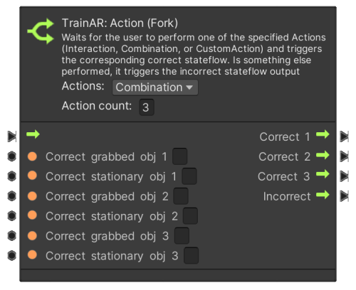

# Action Nodes

**TrainAR: Action** nodes define, which are the correct actions to take for the user in the AR-Training. There are action nodes that require an input in the AR-Context, so interactions with or combination of TrainAR Objects, but there are also action nodes which require input of the user on the user interface (UI Action Nodes), which are documented separately in the [UI Action Node](../manual/UIActionNodes.html) documentation.

## AR interactions with Action Nodes

Interacting with TrainAR Objects in the AR context is possible in two ways: **interacting** and **combining**. The node can be set to the type of interaction via the "Action" drop down menu.


This node is set to Interaction. If the stateflow reaches this point, the node waits for an action by the user. If the user triggers an interact with the TrainAR Object specified in **Correct object**, the stateflow continues according to the **Correct**-Output of the node. Consequently, if any other action is taken by the user, the stateflow continues according to the **Incorrect**-Output of the node.


For **Combinations** the node works similarly, though two objects have to be specfied: the grabbed objects, so the one the user is currently holding, and the object the grabbed object is supposed to be combined with.

## Custom Action

With the Action Node set to **Custom Action** it is also possible to control the stateflow with your own custom actions/triggers as described in the [Advanced Options](https://jblattgerste.github.io/TrainAR/manual/NoVisualScripting.html#using-custom-actions-for-advanced-behaviours). In that case, you need to request a state change to the StatemachineConnector with a parameter. This parameter is checked against the parameter defined in the node and then determined as either **Correct** or **Incorrect** - the stateflow then resumes accordingly.


In this example the correct parameter is defined as "correctParameter".

The following example describes how to request a state change to the StatemachineConnector through C# scripting:

```cs
parameterToCheck = "correctParameter";

StatemachineConnector.Instance.RequestStateChange(new StateInformation(parameter: parameterToCheck));

parameterToCheck = "wrongParameter";

StatemachineConnector.Instance.RequestStateChange(new StateInformation(parameter: parameterToCheck));
```

In the first call to the StatemachineConnector the stateflow continues according to the **Correct**-output of the node, since parameterToCheck is set to the the correct parameter. The second call to the StatemachineConnector results in triggering the **Incorrect**-output of the node, since this is not the parameter specified in the node.

### TrainAR: Action (Fork)

Sometimes you may run into situations where the training procedure you're creating has multiple correct actions at one point. Maybe those actions might even result in a different stateflow after this point. e.g. because there is multiple orders for sub-sequences of the procedure. **TrainAR: Action (Fork)** let you specify multiple correct actions and the stateflow these actions are supposed to result in. 


The number specified in the **Action count** field defines the number of TrainAR Objects with whom an action is considered correct. Consequently, if the number is changed, the node adjusts itself, so the specified number of **Correct objects** and their stateflows can be defined.


This of course also works analogous with **Combinations**.



### TrainAR Action (Multi)

In other cases when creating your training you might run into situations, where multiple actions have to happen, but it doesn't necessarily have to be in in a strict order (e.g. combining multiple TrainAR Objects like vegetables with a soup bowl). These cases can be modeled with the **TrainAR: Action (Multi)** node. 


The **All correct** stateflow is triggered once, when **all** of the defined actions have been performed. If any other actions is registered, the incorrect stateflow is triggered repeatedly on each incorrect action.
