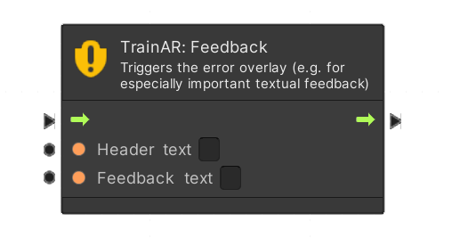
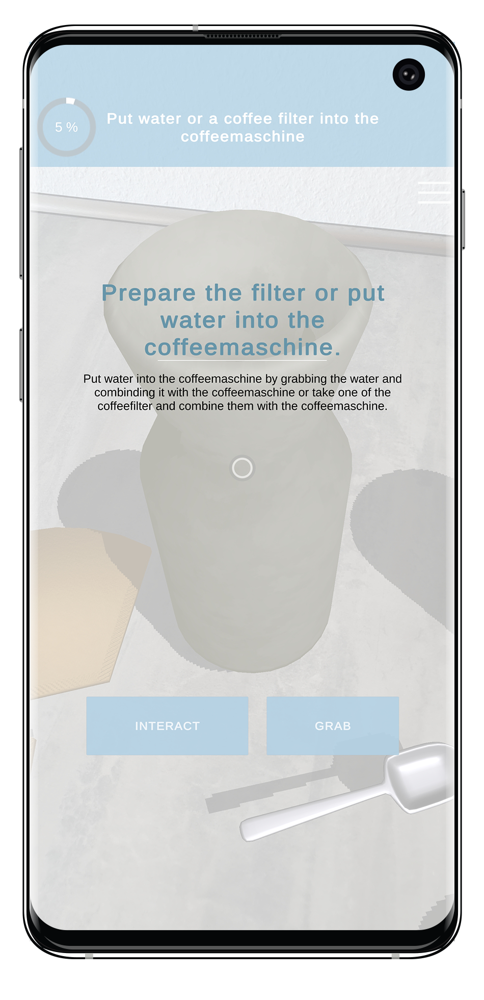

# Feedback Node

The Feedback Node triggers a UI-Overlay, which covers the whole smartphone screen and displays feedback to the user. Therefore its recommended use is for especially important textual feedback, where a simple red blinking outline would not be sufficient. In the node, a header text and the feedback text have to be specified.

From the didactic perspective, this is intended to be used to provide feedback to the user of the training: Telling the user what he did wrong or what he could do to continue. For more detail, read our publication on the TrainAR interaction concept and didactic framework: ["TrainAR: A Scalable Interaction Concept and Didactic Framework for Procedural Trainings Using Handheld Augmented Reality"](https://www.mdpi.com/2414-4088/5/7/30)

| TrainAR Node | Result |
| :----------------------: |:-------------------------:|
|||

