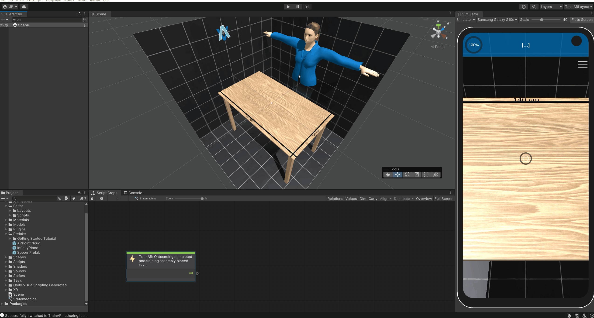
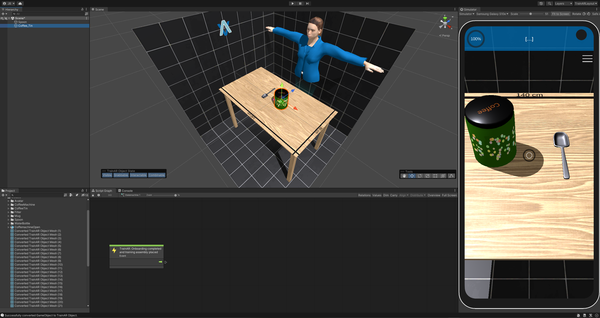
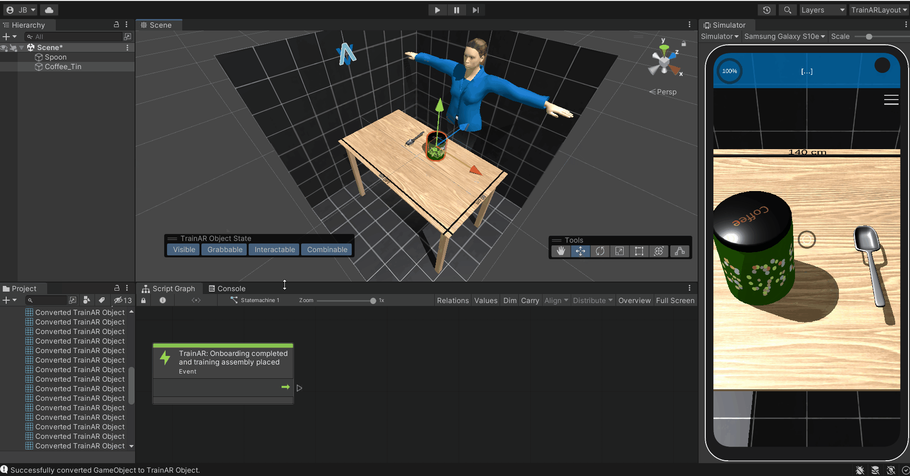
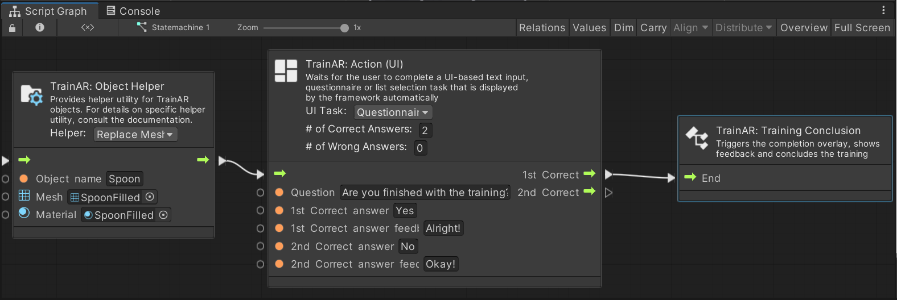
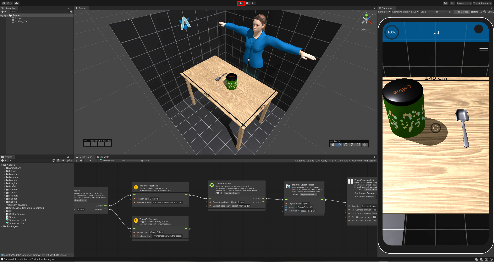

# Getting Started Guide

The Getting Started Guide is meant to provide a "quickstart" for your development of TrainAR trainings and guides you through the process of creating a very simple TrainAR training from scratch. This Getting Started Guide presumes that you already completed the [Installation & Setup](https://jblattgerste.github.io/TrainAR/manual/Setup.html) of Unity and TrainAR. There is a training assembly included in the TrainAR repository that can be deployed directly for testing. You can also try to deploy and test this example first and play around with it as we will delete this shortly: For this, directly skip to "[Deploy your training to your phone](https://jblattgerste.github.io/TrainAR/manual/GettingStarted.html#4-deploy-your-training-to-your-phone)".

## Delete the example TrainAR training

If you started the TrainAR Unity project with Unity Version 2022.1 through the Unity HUB (as described in [Installation & Setup](https://jblattgerste.github.io/TrainAR/manual/Setup.html)) and opened the TrainAR Authoring Tool through the top-panel menu item called "TrainAR" -> "Open TrainAR Authoring Tool". You should now see the TrainAR Authoring Tool roughly like this:

As you can see, there already is a TrainAR training. But we want to develop a TrainAR training from scratch and therefore have to delete the example training. For this we have to delete all TrainAR Objects and the TrainAR stateflow.

To accomplish this, we can click somewhere into the Scene (blue) press `CTRL` + `A` and then `Delete`/`DEL` (`Backspace` on macOS) to delete all TrainAR Objects. 

Afterwards, click somewhere into the Scripting Graph (red) and then again press `CTRL` + `A` to select the complete stateflow in the TrainAR statemachine. **Deselect** the very first node ("TrainAR: Onboarding completed and training assembly placed"), as we need this for each training. Then press `Delete`/`DEL` (`Backspace` on macOS). This deletes the complete TrainAR Stateflow. and the TrainAR Authoring Tool should look roughly like this:

In the scene window you should now still see the reference setup of the current Workspace (a room of black tiles, a table and a female character) but no TrainAR Objects in the Hierarchy or Scene and only the very first, green "TrainAR: Onboarding completed and training assembly placed" node. The reference setup should give you an idea of the size of objects in regards to the real world when viewed in the authoring tool and is not deployed with the TrainAR training.

## Create TrainAR Objects

On the left in the Hierarchy tab is a (currently empty) list of the objects in the scene.

On the Bottom Left, in the Project Tab open the Prefabs folder. There is a Prefab named *Spoon_Prefab*.

Click on this Prefab and drag-and-drop it into the Hierarchy Tab. The spoon should appear on the table.

To interact with this object, you'll have to convert it to a TrainAR Object. To achieve this select the object either in the hierarchy or directly in the scene tab. Press the button with the label *Convert to TrainAR Object* that now appears on the bottom left of the scene tab. A preview window showing the chosen object should appear. This window gives you more specific options before you start the conversion process. For now, just ignore those and click on *Convert to TrainAR Object*". 

You can move the newly created TrainAR object around, rotate it or change its size. To do this, you can switch between different tools in the Tools Bar in the Scene View. For now make sure the Move tool is selected and move the object in a fitting position on the reference-table.

Now add *Coffee_Tin_Prefab* from the Prefabs folder, unpack it and convert it to an TrainARObject, then position it. Your setup should now look kind of like this:

Good! You converted and placed some TrainAR Objects onto the Training Assembly. You could already deploy this training to a device and see your objects in AR but they would not elicit any behaviour or feedback based on the users actions. For this we have to connect the TrainAR Objects in our TrainAR Stateflow.

## Create a TrainAR Stateflow

In the Bottom of the Unity window you should see the window with the Script Graph Tab. 

Here you can create the flow of your training by creating nodes and connecting them. There already is one node in the Script Graph with the description *TrainAR: Onboarding completed and training assembly placed*.

This is the entry point of your training flow and makes sure that when you training starts, TrainAR already handled onboarding and the training assembly was placed into a valid position by the user.

Right click into the Script Graph Window and select *TrainAR* from the Node Menu. From there, select *TrainAR: Action*. 

The *TrainAR Action* node should appear in the Stateflow. There are two types of action you can define: Interaction and Combination. For now leave the chosen action to Interaction. In the *TrainAR: Action* node under the *Correct Action* textfield type in *Spoon*.

Now connect the two nodes by clicking on the output of the *TrainAR: Onboarding completed and training assembly placed* node and connecting the line with the input of the *TrainAR: Action* node.

You have now defined that, at this point in the stateflow (the very start), the correct next step is to trigger an Interaction on the TrainAR Object *Spoon*.

Right click again in the Script Graph window to open the node menu and select the *TrainAR: Feedback* node in the TrainAR nodes folder. This node opens an error overlay. Type a fitting error messages in the textfield and connect the Incorrect output of the *TrainAR: Action* node with the Input of the *TrainAR: Feedback* node.

You have now defined what happens if an incorrect action is taken at this point in the stateflow. Now define what should happens if the correct action is taken.

Create another *TrainAR: Feedback* node and type in feedback for the correct action taken and connect it to the correct output of the *TrainAR: Action* node. Note: This is for demonstration purposes only, Feedback nodes should normally be used for errors and not positive feedback as described in the didactic considerations of our research paper: [TrainAR: A Scalable Interaction Concept and Didactic Framework for Procedural Trainings Using Handheld Augmented Reality](https://www.mdpi.com/2414-4088/5/7/30).

Now create another *TrainAR: Action* node and connect it to the *TrainAR Feedback* for the correct feedback. Select *Combination* as an Action in the node. Under *Correct Grabbed Object* type in *Spoon* and under *Correct stationary Object* type in *Coffee_Tin*. Connect the nodes.

You have now defined, that at this point in the stateflow, the correct step is to combine the spoon with the coffee tin. Next you'll have to define what happens as a result. Let's make the combine fill up the spoon.

To do this add a *TrainAR: Object Helper* node to the stateflow. In the node, set the dropdown menu to *Replace Mesh* and type in the *Object Name* field *Spoon*. In the Project Tab navigate to the Meshes folder and drag-and-drop the *SpoonFilled* mesh into the mesh field of the node. Then, drag-and-drop the *SpoonFilled* material from the Materials folder into the material field. Finally, connect the stateflow.

This basically tells TrainAR, that we want to replace this objects shape and texture as a result of this action (because now there is coffee in it).

Afterwards, add a *TrainAR: Action (UI)* node. A node that can trigger UI Custom Actions. Set the dropdown menu in the node you just created to *Questionnaire*. A UI action node waits for user input on the UI before it continues in a stateflow. In this example, we'll simply ask the user whether or not he want's to finish the training. Therefore write a fitting Questiontext in the *Question* field of the node and add some chooseable answers.
Don't forget to connect the stateflow of the previous node.

Finally, create a *TrainAR: Training Conclusion* node and connect the node from the previous step with it. This tells TrainAR to show the TrainAR Training Assessment and that we are done with the training.

Done!

## The full process from start to finish

Here is the full process of creating this simple training from scratch in one go:

## Deploy your training to your phone
Connect your (Android) phone to your Computer. 

Make sure you have [USB Debugging activated](https://developer.android.com/studio/debug/dev-options) on your phone.

Press the play button in the Unity Editor to deploy your training to your device.

Wait for the process to finish.

Afterwards, unlock your phone.

Your Training should now be deployed to your phone and automatically start. It should also appear as a "TrainAR" App, installed on your device in the menu.

## Test your training

If it did not open automatically, open the now deployed application on your phone through the menu. Your phone might ask you if the TrainAR app should be allowed to use your phones camera. Confirm this, as we need the camera to use Augmented Reality.

A short tutorial that describes the interaction concept of TrainAR should appear. Navigate through the tutorial/onboarding to start your training. 

The camera feed of your device should start and you're asked to find a flat surface to scan. Follow these instructions. This should result in the setup you just created being placed onto a table surface.

Now you can go through the chain of actions you just defined into the TrainAR Stateflow, which should look roughly like this:

