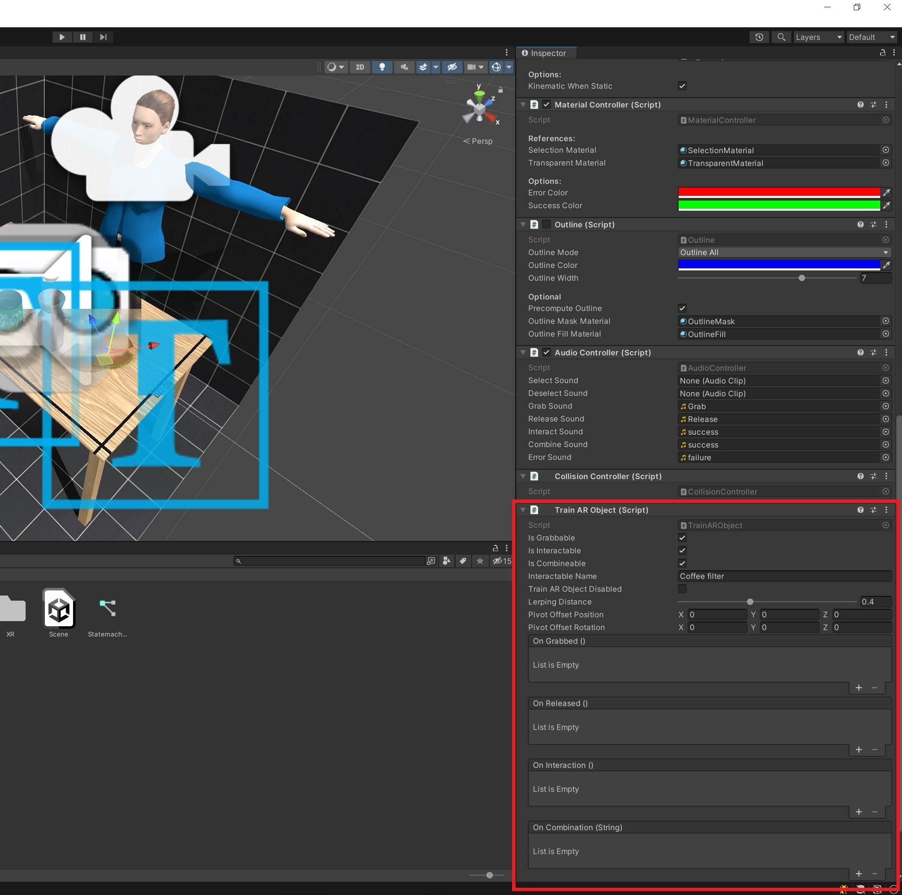

# Advanced Options - AR Beyond the Train__

TrainAR is mainly aimed towards non-programmers, designer and domain-experts that do have significant media competency but not necessarily programming expertise. Nontheless, TrainAR can also aid the AR development of people with programming skills and Unity expertise. As a central concept, TrainAR is integrated into the Unity Editor as a host software for the simple reason, that this allows people to expand the framework at will to realize trainings outside of the original scope of TrainAR. Several deliberate design decisions were made to keep this possibility and there are multiple options to break out of the TrainAR scope as explained below.

Generally, not meant to be a technical documentation but rather an abstract visualization for explanatory purposes of the following documentation: A TrainAR training technically starts with the [Prefab Spawning Controller](https://jblattgerste.github.io/TrainAR/api/Others.PrefabSpawningController.html) that allows the user to place the training assembly in the environment and signals the [Onboarding Controller](https://jblattgerste.github.io/TrainAR/api/UI.OnBoardingController.html) when and where sufficiently large surfaces were detected. After the assembly is placed, the [Interaction Controller](https://jblattgerste.github.io/TrainAR/api/Interaction.InteractionController.html) is triggered and starts to listen to the [Interaction Button Controller](https://jblattgerste.github.io/TrainAR/api/UI.InteractionButtonController.html). When a Button (e.g. interaction or combination) is pressed, while a [TrainAR Object](https://jblattgerste.github.io/TrainAR/api/Interaction.TrainARObject.html) is selected, the TrainAR Object sends a request to change its state in form of a [State Information](https://jblattgerste.github.io/TrainAR/api/Static.StateInformation.html) struct to the [Statemachine Connector](https://jblattgerste.github.io/TrainAR/api/Static.StatemachineConnector.html). The Statemachine Connector then hands this State Information to the [Visual Statemachine](https://jblattgerste.github.io/TrainAR/api/Visual_Scripting.html) which then checks it against its internal state set by the author of the training and answers to the Statemachine Connector if this request was a valid or invalid request. On the one hand, the Statemachine Connector then hands this information back to the TrainAR Object, which can then trigger object-level behaviours based on this decision (e.g. shading, audio playbacks, outling, animations, Custom events or physics). On the other hand the Statemachine Connector also triggers flow-level Actions for the [Questionnaire Controller](https://jblattgerste.github.io/TrainAR/api/UI.QuestionnaireController.html), [Top Panel Controller](https://jblattgerste.github.io/TrainAR/api/UI.TopPanelController.html), [Error Overlay Controller](https://jblattgerste.github.io/TrainAR/api/UI.ErrorOverlayController.html), and [Direct Info Controller](https://jblattgerste.github.io/TrainAR/api/UI.DirectInfoController.html) when requested by the Visual Statemachine as a consequence of this action.


## Unity Visual Scripting Nodes

The first and easist possibility is to utilize non-TrainAR [Unity Visual Scripting nodes](https://docs.unity3d.com/Packages/com.unity.visualscripting@1.7/manual/vs-nodes.html) inside of a TrainAR Stateflow. E.g. to delay feedback by using the cooldown node before executing the next TrainAR node as shown in the figure below. This effectively provides the possibility of expanding the flow-level behaviour possibilities of TrainAR to match the Unity Visual Scripting abstraction layer on demand.


## Switching to the default Unity Editor

Secondly, authors can switch to the regular Unity Editor layout by navigating to the TrainAR Tab at the top of the screen and clicking on *Open Unity Editor*. This can be used to access and customize object-level behaviours like collision, physics, outlining, materials, shaders, transform components, or use the object-level behaviour events that are exposed on the "TrainAR Object" and trigger Unity components or custom C# behaviours based on them.

This transition is hereby seemless and authors can create a basic flow using the Authoring Tool and then customize more indepth object-level behaviours in the Unity Editor layout if necessary.



## Using Custom Actions for Advanced Behaviours

One way to expand the flow-level behaviours outside of the provided functionality of the TrainAR Framework, while still using the visual scripting component for the Statemachine, is to use Custom Actions. Here, authors can either attach the [CustomAction](https://jblattgerste.github.io/TrainAR/api/Static.CustomAction.html) component to a GameObject (not necessarily a TrainAR Object) and call the DynamicTrigger() function or call the CustomAction.StaticTrigger() in the static context from anywhere in the solution.

```cs
    public class CustomAction : MonoBehaviour
    {
        public void DynamicTrigger(string parameter)
        {
            StaticTrigger(parameter);
        }
        
        public static bool StaticTrigger(string parameter)
        {
            return StatemachineConnector.Instance.RequestStateChange(new StateInformation(interactionType:InteractionType.Custom, parameter:parameter));
        }
    }
```


## Using TrainAR without the Visual Statemachine

Finally, while the visual scripting is an integral part of TrainAR, it is possible to use TrainAR without the visual scripting and the TrainAR visual statemachine component. This can for example be useful to implement non-procedural or rule-based training stateflows or to develop AR learning games based on the framework that only utilize interaction and feedback modalities without the didactic ideas behind TrainAR.

As visualized in the technical flow figure, the Visual Statemachine is only communicating with the Statemachine Connector through State Information structs. To disable visual scripting, authors simply need to comment a specific piece of code in the [*StatemachineConnector*](https://jblattgerste.github.io/TrainAR/api/Static.StatemachineConnector.html) in the function [*RequestStateChange()*](https://jblattgerste.github.io/TrainAR/api/Static.StatemachineConnector.html#Static_StatemachineConnector_RequestStateChange_Static_StateInformation_).

Look for this part:

```cs
acceptedStateChange = stateInformation.interactionType switch
            {
                InteractionType.Grab => true, //For grabbing this is always true, selection, deselection and release are not calling this
                InteractionType.Combine => stateChangeTrigger.Invoke(stateInformation),
                InteractionType.Interact => stateChangeTrigger.Invoke(stateInformation),
                InteractionType.Custom => stateChangeTrigger.Invoke(stateInformation),
                _ => acceptedStateChange
            };
```

And and comment it out like this:

```cs
/*
acceptedStateChange = stateInformation.interactionType switch
            {
                InteractionType.Grab => true, //For grabbing this is always true, selection, deselection and release are not calling this
                InteractionType.Combine => stateChangeTrigger.Invoke(stateInformation),
                InteractionType.Interact => stateChangeTrigger.Invoke(stateInformation),
                InteractionType.Custom => stateChangeTrigger.Invoke(stateInformation),
                _ => acceptedStateChange
            };
*/
```

If authors choose to do this, they have to handle the requested statechange themselves by analyzing the provided State Information struct and returning true or false within the function to communicate the acceptance or denial of the request. The processing of this information is then still handled by the TrainAR framework. They furthermore have to handle the feedback modalities like instructions, feedback UI, questionnaires or expert insights manually. This is possible by just manually calling the methods [*UpdateTopPanel()*](https://jblattgerste.github.io/TrainAR/api/Static.StatemachineConnector.html#Static_StatemachineConnector_UpdateTopPanel_System_String_System_Int32_), [*ShowErrorOverlay()*](https://jblattgerste.github.io/TrainAR/api/Static.StatemachineConnector.html#Static_StatemachineConnector_ShowErrorOverlay_System_String_System_String_), [*StartQuestionUI()*](https://jblattgerste.github.io/TrainAR/api/Static.StatemachineConnector.html#Static_StatemachineConnector_StartQuestionUI_UI_QuestionnaireController_QuestionUITypes_System_String_System_Collections_Generic_List_UI_QuestionnaireController_Answer__), [*ShowExpertInsights()*](https://jblattgerste.github.io/TrainAR/api/Static.StatemachineConnector.html#Static_StatemachineConnector_ShowExpertInsights_AudioClip_Sprite_System_String_), and [*ShowCompletionOverlay()*](https://jblattgerste.github.io/TrainAR/api/Static.StatemachineConnector.html#Static_StatemachineConnector_ShowCompletionOverlay) in the [*Statemachine Connector*](https://jblattgerste.github.io/TrainAR/api/Static.StatemachineConnector.html) to trigger corresponding Actions that are then also automatically executed by the TrainAR framework.
