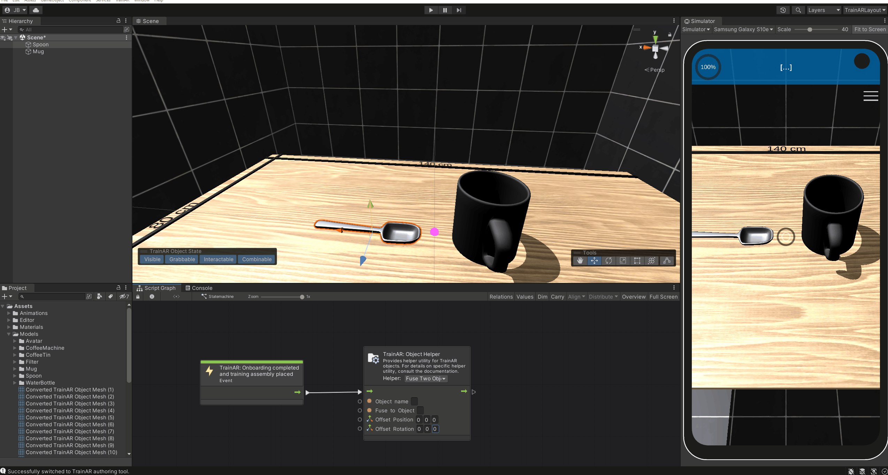

# Object Helper Node

As specified in the [TrainAR Objects](TrainArObjects.html) documentation, TrainAR Objects have states and behaviours. The Object Helper nodeprovides various options to access and modify these from within the TrainAR Stateflow at runtime of the TrainAR training. In the **Helper** dropwodn menu you can select from the different options. To specifiy which **TrainAR Object** in the scene you want to modify, specify the exact **Object name** in the node.

| TrainAR Node | Result |
| :----------------------: |:-------------------------:|
|||

## Toggle Visibility

Check or uncheck the **Visible** field to make the specified **TrainAR Object** visible or invisible.

## Toggle Grabbable

Check or uncheck the **Grabbable** field to make the specified **TrainAR Object** grabbable or not grabbable.

## Toggle Interactable

Check or uncheck the **Interactable** field to make the specified **TrainAR Object** interactable or not interactable.

## Toggle Combinable

Check or uncheck the **Combinable** field to make the specified **TrainAR Object** combinable or not combinable.

## Change Interaction text

Changes the labeling of the interaction button when selecting an TrainAR Object. A TrainAR Object is selected when you aim at a TrainAR Object and move close to it.

By default the labeling is simply *Interact* for every TrainAR Object.

## Change Lerping distance

This changes the distance with which a **grabbed TrainAR Object** floats away from the screen. Generally, you probably want to have bigger TrainAR Objects float at a larger distance than smaller ones. That way, they don't cover the whole screen while grabbing them.

## Change Mesh and Texture

With this option, you can change what a **TrainAR Object** looks like by changing it's mesh and/or material. This is for example useful if as a result of a combination or interaction an object is supposed to be altered.

## Get Object Reference

This node returns the **Unity GameObject** Reference of the specified **TrainAR Object**. For more information about Unity GameObjects, refer to the [Unity Documentation](https://docs.unity3d.com/ScriptReference/GameObject.html). This is mainly useful if you want to utilize Unitys Visual Scripting nodes in the Stateflow as specified in the [Advanced Options](https://jblattgerste.github.io/TrainAR/manual/NoVisualScripting.html#unity-visual-scripting-nodes).

## Fuse Two Objects

The *Fuse-Object*setting  attaches one **TrainAR Object** to another, making them one. The **Object name** field specifies the object that is fused onto the other object. The other object is specified in the **Fuse to Object** field. In the **Offset Position and Rotation** field the position and rotation relative to the fused with TrainAR Object is specified. To determine the offset position and rotation, place the two objects in the desired position and rotation in the scene view. Then select both of these objects (shift-click on each of them). A toolbar should appear on the bottom left of the scene view, which displays the offset position and rotation of the selected objects. These are the offset values you need to enter in the **Object Helper Node**. When you're done entering the values, don't forget to reset the objects to their default position and rotation in the scene view.

Note: You may need to flip the signing of the values when entering them in the *Object Helper node* (i.e.: -1.5 becomes 1.5 and vice versa).

## Destroy Object

Destroys and removes the specified TrainAR Object from the scene. 

## Replace TrainAR Object
Replaces a to be **replaced TrainAR Object** with another **replacing TrainAR Object**. The replaced **TrainAR Object** is set to invisible. The **replacing TrainAR Object** is also placed at the same position as the **replaced TrainAR Object**.

In case the **replaced TrainAR Object** is **grabbed** during replacement, the **replacing TrainAR Object** is also **grabbed**. For further instructions on how to use this setting, see [here](../manual/TrainArObjects.html#swapping-or-modifying-trainar-objects-during-a-training)