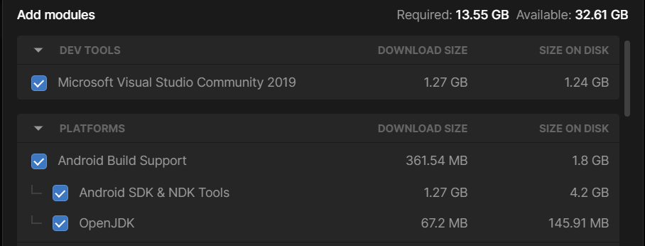
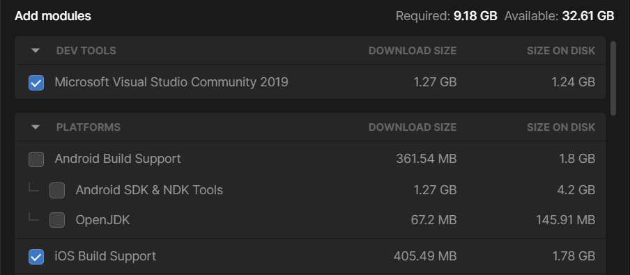
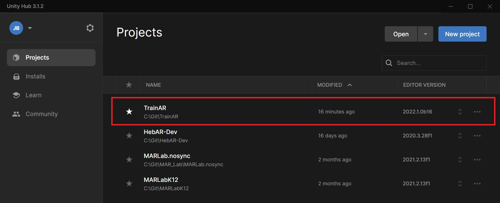
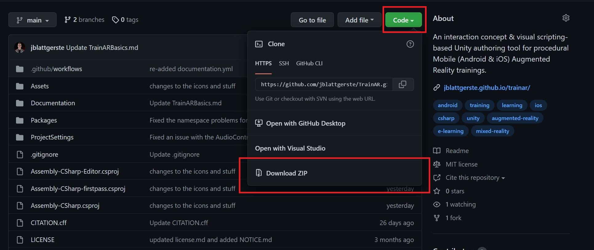
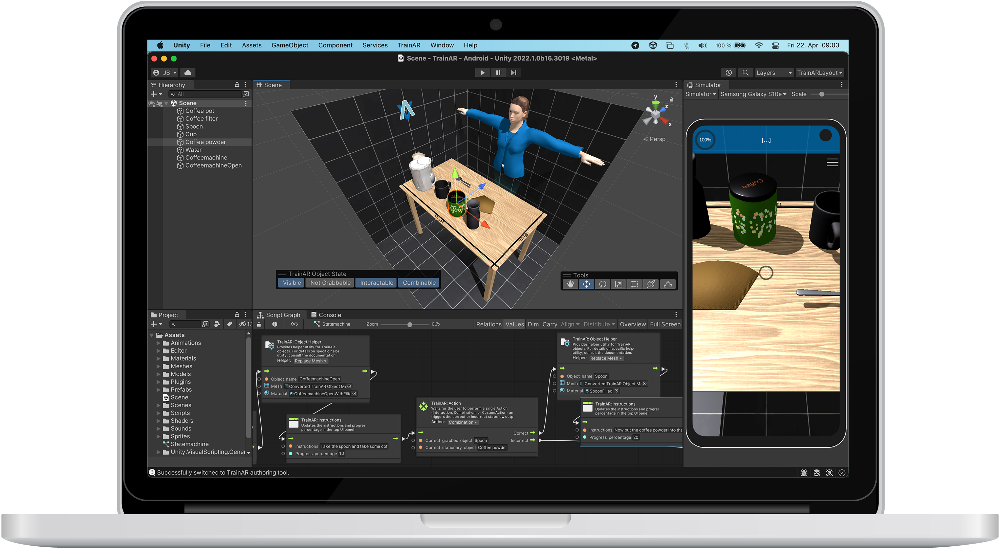

# Installation & Setup

## Download & Install Unity

First, [download](https://unity3d.com/de/get-unity/download) and install the [Unity Hub](https://docs.unity3d.com/hub/manual/InstallHub.html). The Unity Hub allows you to easily install the correct Unity Editor version and corresponding packages that are needed for platform specific deployments.

After installing Unity HUB, install **Unity 6.7 Alpha (`6000.7.0a6`)** as described in the [Unity Hub Documentation](https://docs.unity3d.com/hub/manual/InstallEditors.html).

> [!IMPORTANT]
> Ideally, use this exact Editor version to match the project.

When installing Unity, make sure to also include the correct modules, depending on which kind of device you want to deploy the TrainAR trainings to:

For Android choose **Android Build Support**. Make sure to have also **Android SDK & NDK Tools** and **OpenJDK** checked:

For iOS, choose **iOS Build Support**:

You can also install both at the same time to deploy to both devices. This works on every operating system (Linux, Windows and macOS), though for iOS, XCode on macOS is necessary to [deploy to iOS devices](https://docs.unity3d.com/Manual/UnityCloudBuildiOS.html) after building the App.

Furthermore, if you do not already have an IDE (Integrated Development Environment) installed and you plan to potentially use C# programming to expand TrainAR, we recommend also installing Microsoft Visual Studio with Unity.

## Get the TrainAR Authoring Tool

After installing Unity we have to set up the TrainAR Authoring tool. There are two ways to accomplish this.

1. Creating a Fork of the TrainAR Repository
2. Manually downloading TrainAR

> [!TIP]
> We strongly recommend using the first approach.

### 1. Creating & Cloning a TrainAR Repository Fork

1. Create a GitHub account.
2. [Fork](https://docs.github.com/en/get-started/quickstart/fork-a-repo) the TrainAR repository into your account
3. [Download](https://desktop.github.com/) the GitHub Desktop client
4. Clone the forked repository in the GitHub client
5. Open the Unity HUB
6. Add the now cloned repository through clicking **Open** and then selecting the folder that was downloaded in the GitHub client

TrainAR should now appear in the list of projects with **Unity 6.7 Alpha (`6000.7.0a6`)** selected as the Editor version.

### 2. Manually downloading TrainAR

Alternatively, you can manually download TrainAR from the GitHub repository as a .zip file, unpack it and then open it in the Unity Hub by clicking **Open** and then selecting the folder that was downloaded in the GitHub client.

While faster, we don't recommend this approach, as [version control](https://ourcodingclub.github.io/tutorials/git/) is a very helpful tool to prevent losing progress, e.g. because of errors or problems in the TrainAR framework.

## Opening the TrainAR Authoring Tool

Open the "TrainAR" project in Unity Hub and wait for the initial import and compilation to finish. On the first launch, TrainAR automatically opens the authoring scene, applies the authoring layout, and opens the training graph.

If neither Android nor iOS is selected as the active platform and Android Build Support is installed, this first-launch setup also switches the project to Android. An existing Android or iOS selection is preserved. This setup does not reset your platform or layout every time you open the project.

If you need to open the authoring tool manually, choose **TrainAR → Open TrainAR Authoring Tool** from the top menu. You should now see the TrainAR Authoring Tool like this:

