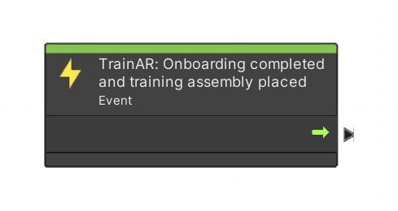
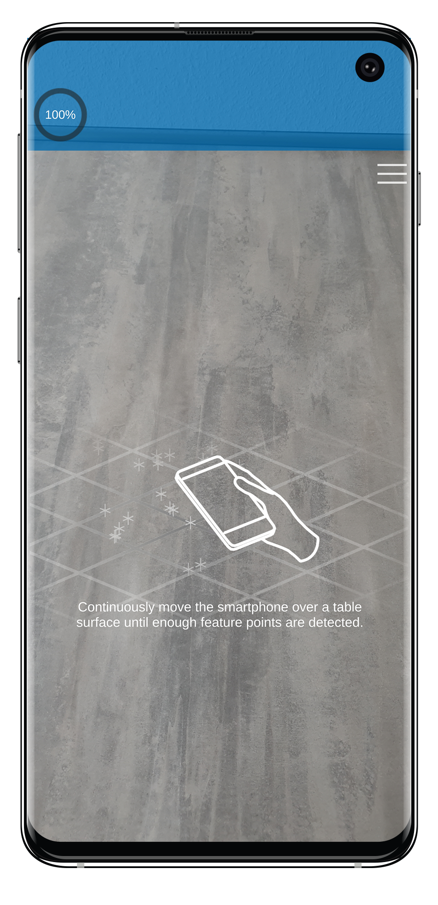

# Start Training Node

The (green) Visual Scripting node called **TrainAR: Onboarding completed and training assembly placed** is an event node that is automatically executed when the TrainAR framework recognizes that the user of the training finished watching the onboarding, a surface was found and the training assembly was placed by the user. It acts as a starting point for a TrainAR training created by the author.

> [!IMPORTANT]
> There should be only one **TrainAR: Onboarding completed and training assembly placed** node present in a TrainAR Stateflow.

> [!NOTE]
> While all other TrainAR nodes can be found under Right Click → **TrainAR**, the starting node is located under Right Click → **Events**.

| TrainAR Node | Result |
| :----------------------: |:-------------------------:|
|||

