# TrainAR Nodes

TrainAR Nodes are used in the TrainAR Stateflow to model the behaviour and procedural flow of the AR trainings created with TrainAR. TrainAR Nodes define what the next correct step in your training is but also how your training responds to correct or incorrect actions taken by the user. Consequently, there are TrainAR Nodes which **wait** for an **Action** to be taken by the user, these are called **TrainAR Actions**. **TrainAR Actions** consist of actions taken in the AR-context (so, grabbing, interacting or combining) or UI-actions (i.e a UI element which pops up and asks the user a question). How your training reacts to correct or incorrect steps taken by the user are defined by **TrainAR Insight-, Instruction-, Feedback- and Object Helper Nodes**. They are triggered instantly and continue the stateflow automatically after they performed their task. With these, you can instruct the user of the training, define the consequences of the users actions in the AR-context and give feedback or expert insights for these actions in the form of textual information displayed on the UI.

## Overview

| TrainAR Node | Result | Description |
| :----------------------: |:-------------------------:| :-------------------:|
|||Starts the TrainAR Stateflow  [Read more](StartTrainingNode.html)|
|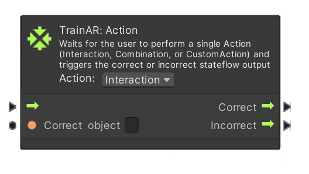|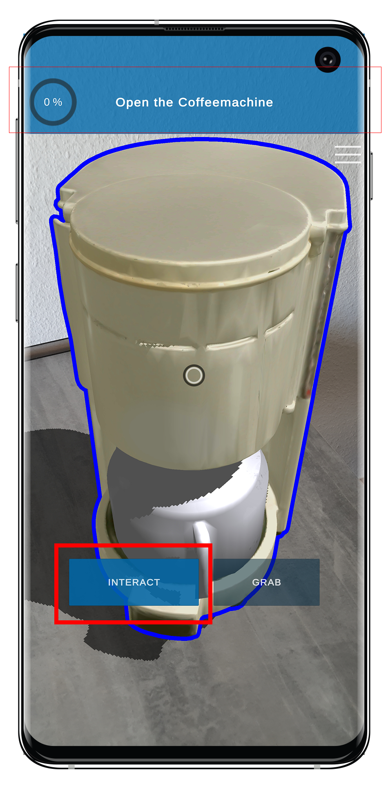|Waits for an Action (Interact, Combine or Custom)  [Read more](ActionNodes.html)|
|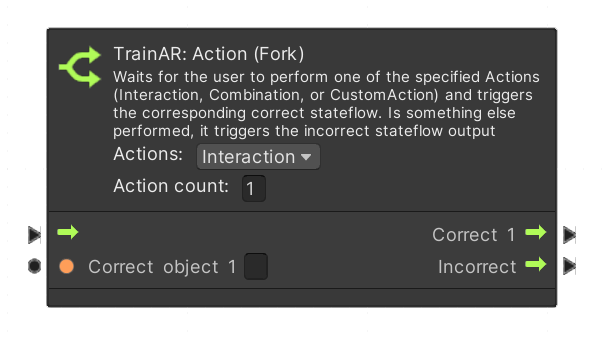|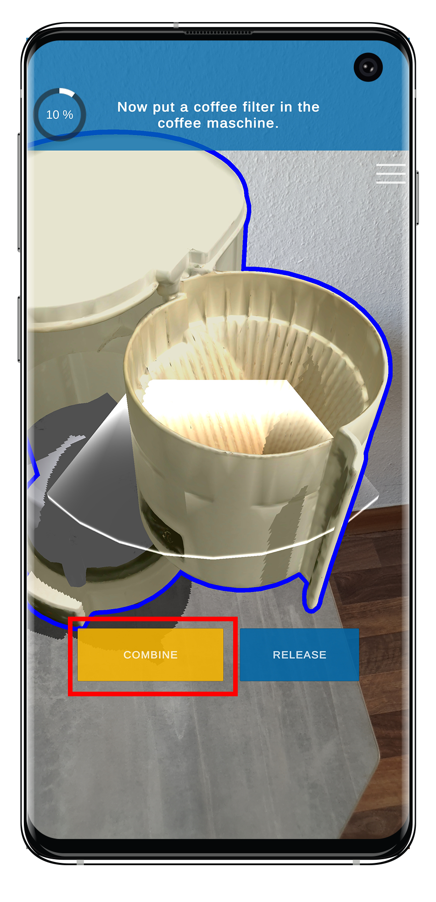|Waits for an Action, Forks the Stateflow based on which Action was performed  [Read more](ActionNodes.html)|
|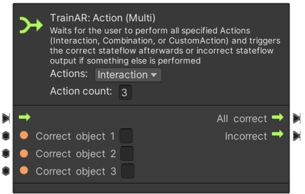|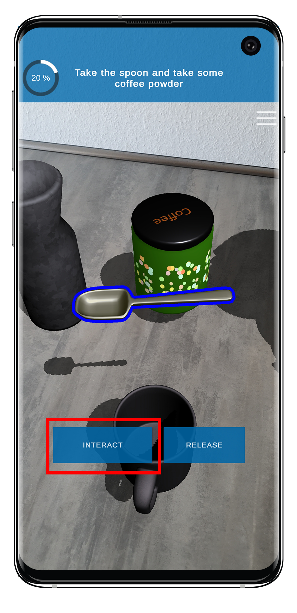|Waits for _n_ Actions to be performed (in any order)  [Read more](ActionNodes.html)|
|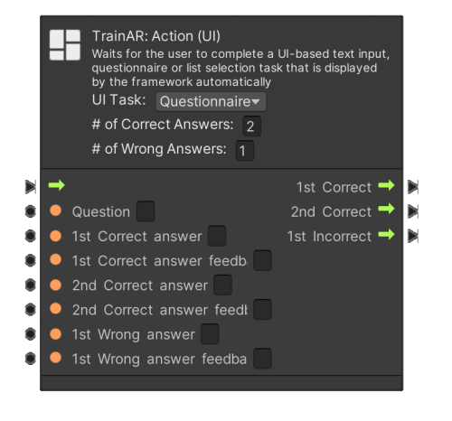|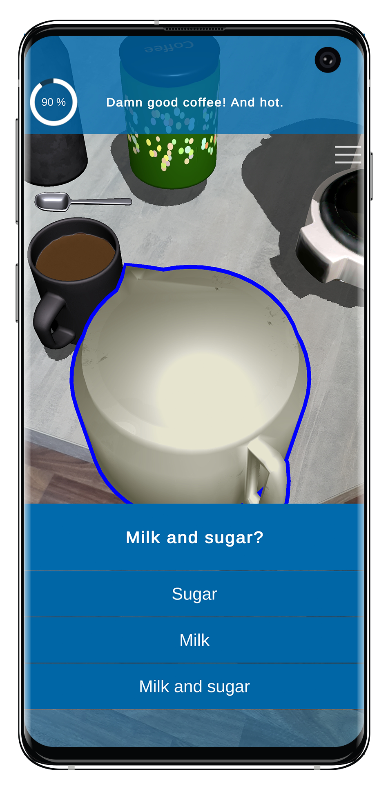|Triggers and waits for a UI quiz to be answered  [Read more](UIActionNodes.html)|
|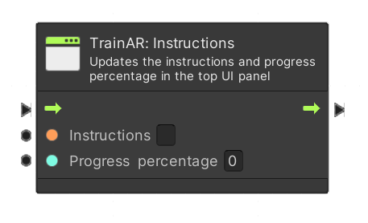|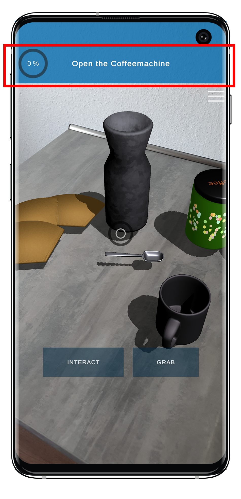|Shows new instructions to the user  [Read more](InstructionNode.html)|
|||Shows a feedback overlay to the user  [Read more](FeedbackNode.html)|
|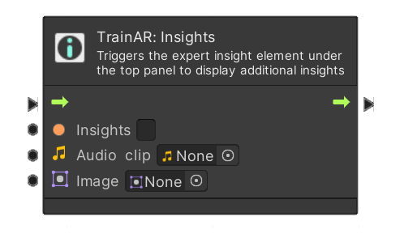|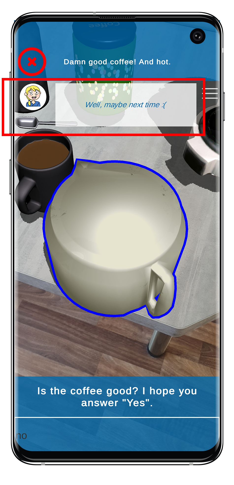|Shows Insights (e.g. additional tips and tricks) to the user  [Read more](InsightNode.html)|
|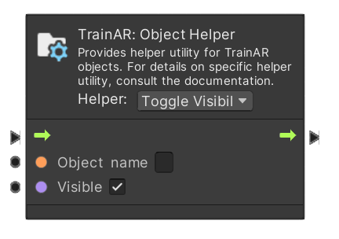|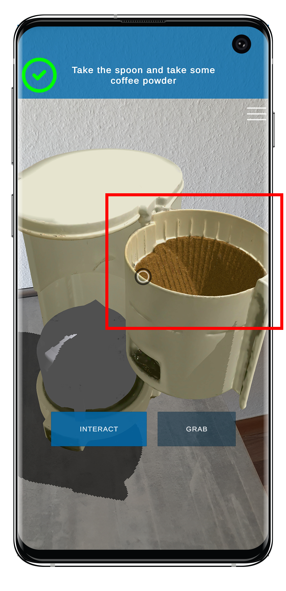|Performs object-level behaviour/state changes  [Read more](ObjectHelperNode.html)|
|||Concludes the training and TrainAR Stateflow  [Read more](TrainingConclusionNode.html)|

