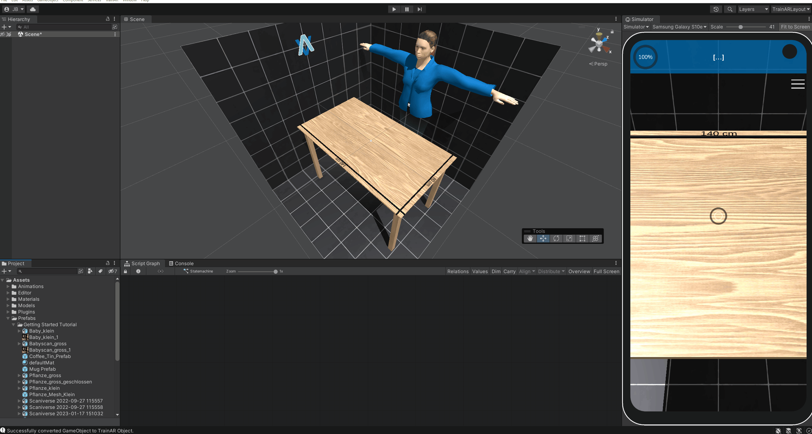
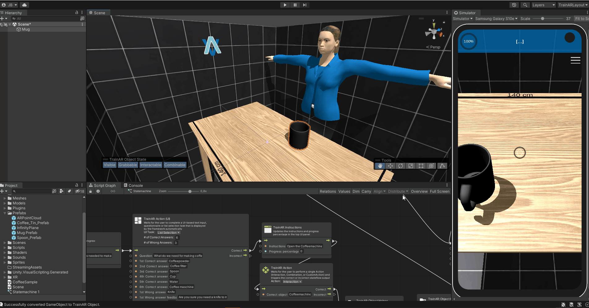

# Creating and Converting TrainAR Objects

To be able to use 3D assets/models for interactions in TrainAR trainings, you need to convert them to **TrainAR Objects** first. This gives them default TrainAR functionality/behaviours and makes them usable in the TrainAR Stateflow.

To convert a 3D model into a **TrainAR Object**, simply drag-and-drop it from the project tab into the hierarchy tab. To start the conversion either right click on it in the hierarchy tab and select "Convert to TrainAR Object". Alternatively, while the object is selected, press the appearing button on the bottom left of the scene tab with the label *Convert to TrainAR Object*. Either way, a preview window displaying the selected object will appear.

This window contains various settings for the conversion process: 

* The **TrainAR Object Name** is used to reference this specific object in the [TrainAR Stateflow](../manual/VisualScripting.html).
* The **Object Quality** let's you reduce the quality of the object by lowering the polygon count. Sometimes objects may be to detailed to be efficiently used. It is recommended to not exceed 100000 polygons for all the objects in the entire training.
* The advanced quality setting options let you further customize the quality of the object.

To finalize the conversion simply press the *Convert to TrainAR Object*-button on the bottom of the preview window. Depending on how complex the object is, this may take a few seconds or even minutes.

Note: An object may only be converted to a TrainAR Object, if was not already converted and it has a Transform, MeshFilter and a MeshRenderer applied to it. SkinnedMeshRenderers are currently not supported.

## Object States

A **TrainAR Object** has certain state attributes with which you can control in which kinds of ways the object can be interacted with. These states are:

**Visible:** Whether or not this TrainAR Object is visible or invisible.

**Grabbable:** If this is enabled, objects may be grabbed and moved around by the user. Therefore this should be disabled, in case of stationary objects.

**Interactable:** Whether or not it is possible to trigger interactions on this object.

**Combineable:** Whether or not it is possible to combine other TrainAR objects with it.

If you have selected a TrainAR Object in the Authoring Tool, you can alter the state TrainAR objects start the training with by clicking on them in the **Object State Toolbar**. Note: You can also change TrainAR object states during the training through the [Object Helper Node](https://jblattgerste.github.io/TrainAR/manual/ObjectHelperNode.html) in the TrainAR Stateflow.

## Transform Tools

With the Transform Tools you can configure your TrainAR Objects further. For example, you can move, rotate, or scale objects and alter their Bounding Box.

The Transform tool is a convenient combination of the previous tools.

With the Bounding Box Tool you can configure the bounding box of the object, which among other things, defines at what point TrainAR Objects are overlapping, so they can be combined with each other.

Tip: Holding alt and clicking pins the center in place and clicking shift makes it possible to scale the bounding box uniformly.

## Swapping or modifying TrainAR Objects during a training

One of the problems you'll run in quite frequently when creating trainings with *TrainAR* is that you want to modify **TrainAR Objects** or swap them out **TrainAR Objects** all together, for example as a result of an *Interact* or *Combine*. This can be achieved in various ways, some of which are explained in the following examples.

### Replacing the whole TrainAR Object
You'll need to have prepared two 3D models as TrainAR Objects. One **replacing object** and one to be **replaced object**. Both need to be added to the training setup from the beginning, the **replacing object** can be set to invisible if it's not supposed to be in the training at training startup, from a user perspective.

To replace one object with another use the *TrainAR Node: Object Helper* with the option *Replace TrainAR Object*. In the *Object name* textfield of the node put in the name of the **replaced object** and in the *Replace with* text field the name of the **replacing object**.

The following two examples demonstrate this process.

#### Example 1: Simple replacement
In this example consisting of a packaged syringe that is supposed to be "unpacked" by replacing the packaged model with the unpackaged syringe. The user can do this by triggering an *Interact* on the packaged syringe. As a result, the packaged syringe model is then replaced by the unpackaged syringe.

Add both **TrainAR Objects** in the training setup. Set the **replacing object**, in this case the syringe, to invisible.

To open the package, the user is supposed to interact with the packaged syringe. Consequently, add a [*TrainAR Action*](../manuals/ActionNode.html) node to the script graph, which references the packaged syringe **TrainAR Object**. As a result the packaged syringe is replaced with the syringe itself. Therefore add a [*TrainAR Object Helper*](../manual/ObjectHelperNode.html) node and choose the option *Replace TrainAR Object*. Then, enter the object names of the packaged syringe and the syringe in the respective fields in the node.

#### Example 2: Combining two objects to one
Sometimes you may want to model the attachment of one model to another. This can also be realized with the [*TrainAR Object Helper*](../manual/ObjectHelperNode.html) node, but with an additional step.

In this example we want to connect a needle to the syringe. For this, three **TrainAR Objects** are needed: the syringe without needle, the syringe with needle and the needle. The syringe with needle needs to be set to invisible at the start of the training. At first, we again add a [*TrainAR Action*](../manual/ActionNodes.html) node as a trigger for the replacement process, this time set to *combine*. The *grabbed object* in this case is the syringe and the *stationary object* is the needle. Next, the syringe is replaced via a *TrainAR Object Helper* node. Since the needle is now attached to the syringe, the needle model can be set to invisible. This is done as well with a *TrainAR Object Helper* node, but with the option *Toggle Invisible*.

### Fusing two Objects

Another option is to directly attach one TrainAR Object to another TrainAR Object. This is possible when using[*TrainAR Object Helper*](../manual/ObjectHelperNode.html) with the option set to *Fuse Two Objects*. The **Object name** field specifies the object that is fused onto the object, which is specified in the **Fuse to Object** field. In the **Offset Position and Rotation** field the position and rotation relative to the fused with TrainAR Object is specified. To determine the offset position and rotation place the in the desired position and rotation in the scene view. Then select both of these objects (shift-click on each of them). A toolbar should appear on the bottom left of the scene view, which displays the offset position and rotation of the selected objects. These are the offset values you need to enter in the **Object Helper Node** to fuse them in the specified position and rotation. After you're done entering the values, don't forget to reset the objects to their default position and rotation in the scene view.

Note: You may need to flip the signing of the values when entering them in the *Object Helper node* (i.e. -1.5 becomes 1.5 and vice versa).

## Object-level Behaviours

Nothing to do here for now. 

TrainAR Objects automatically inherit all necessary behaviours like physics, collisions, outlining, sounds, shadows, interactions and many more for TrainAR to work consistently. There might be cases where you want more than what is provided. E.g. playing a specific sound on a specific combination of two objects, outlining this specific object on selection in pink (for some reason) or showing a cat GIF when this object is interacted with. How to accomplish these object-level behaviours by listening to TrainAR Object interaction events is described in the [Advanced Options](https://jblattgerste.github.io/TrainAR/manual/NoVisualScripting.html#switching-to-the-default-unity-editor).
