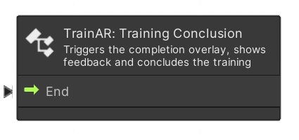
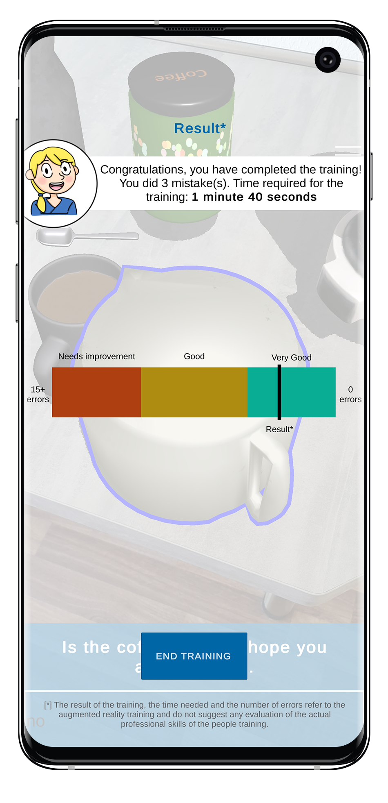

# Training Conclusion Node

The **TrainAR: Training Conclusion** node is the end of the TrainAR stateflow and training. It opens a training assessment, providing an overview with various performance metrics, accumulated over the training. This e.g. includes a graph displaying the number of incorrect actions performed by the user during the training.

> [!IMPORTANT]
> There should be only one **TrainAR: Training Conclusion** node present in a TrainAR Stateflow but it can be triggered from multiple Outputs from different stateflows of the training.

| TrainAR Node | Result |
| :----------------------: |:-------------------------:|
|||

