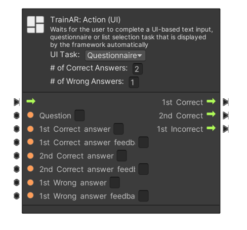
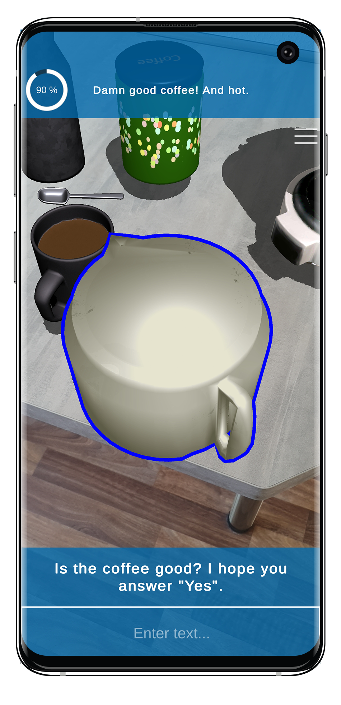
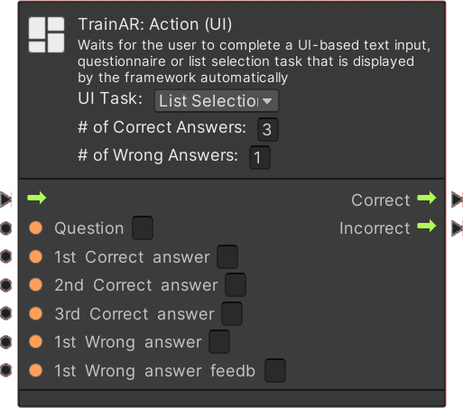

# TrainAR UI Action

**TrainAR: Action (UI)** nodes trigger UI quizes/questionnaires for the user to complete in the TrainAR training. UI Action notes require input of the user on the user interface and the UI Action node includes different types of quizes/questionnaires in form of UI elements. To select which questionnaire type you want to use, you may change via the dropdown menu **UI-Task:** Questionnaire, Input Field or list selection actions.

### UI Task: Questionnaire

If the UI Task is set to **Questionnaire**, the user will be shown a question and a set of predetermined answers. When the user chooses one of these answers, the user is also shown feedback. The question itself as well as the number of corresponding correct and wrong answers and their feedback have to be specified in the node. The questionnare can have between 2 and 4 possible answers. If the user inputs an answer, the stateflow resumes according to the **Correct** or **Incorrect** outputs of the node. Questionnaire nodes can also fork the Stateflow based on the given answer.

| TrainAR Node | Result |
| :----------------------: |:-------------------------:|
|||

### UI Task: Input Field

With the UI Task set to **Input Field**, the user has to type in his answer to a question via the smartphones on-screen keyboard. The questions as well as all correct answers have to be specified in the node. If the user inputs an answer, the stateflow resumes according to the **Correct** or **Incorrect** outputs of the node depending on if the users answers is one of the specified correct answers or not.

| TrainAR Node | Result |
| :----------------------: |:-------------------------:|
|||

### UI Task: List Selection

With the UI Task set to **List Selection**, the user is presented with a scrollable list of possible anwers, which can be defined, as well as their respective feedback, in the node. If the user chooses all correct items in the list, the **Correct** output is triggered.
 
| TrainAR Node | Result |
| :----------------------: |:-------------------------:|
|||
