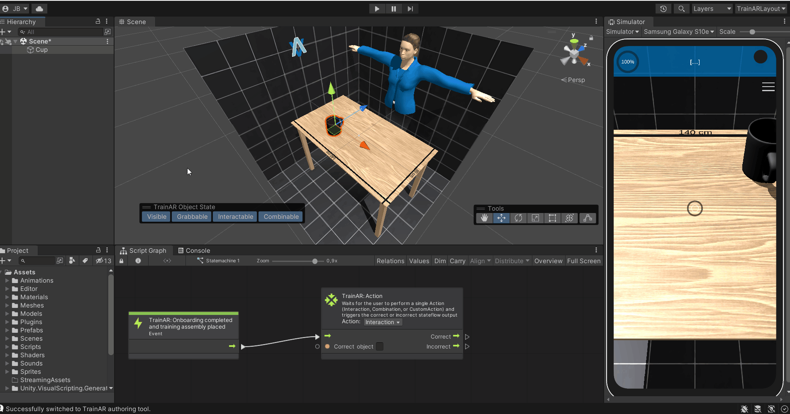

# Creating a TrainAR Stateflow

By creating a TrainAR Stateflow, you describe the procedural sequences of actions for the training you create with TrainAR. In essence, this stateflow describes at which points, which actions are expected of the user and how TrainAR reacts to those actions. For the example TrainAR training, that is shipped with the repository, the created TrainAR Training with its corresponding TrainAR Stateflow looks like this:

> [!Video https://www.youtube.com/embed/tD1q2TXx18g]

## TrainAR Nodes: The Starting Node

A "node" is simply one element of the TrainAR stateflow. For example, the *TrainAR: Onboarding completed and training assembly placed* node acts as a starting point for your TrainAR Stateflow. The stateflow continues from this point, as soon as the training setup is placed. There always has to be exactly one Starting Node present in the stateflow.

## Connecting Node Inputs & Outputs

TrainAR Nodes have various inputs and outputs. By connecting the nodes with eachother, you control the procedural flow of your training. Connecting nodes is done by connecting an output of one node with the input of another. One output can only be connected to one Input of the next node but one Input can be used from several outputs. How to fork a TrainAR Stateflow is described in detail in the [Action Node](https://jblattgerste.github.io/TrainAR/manual/ActionNodes.html) documentation.

TrainAR comes with 10 TrainAR-specific nodes that can be connected with each other. They are described in detail in the [TrainAR Nodes](TrainARNodes.html) documentation. As desrribed in the [Advanced Options](https://jblattgerste.github.io/TrainAR/manual/NoVisualScripting.html#using-custom-actions-for-advanced-behaviours), Unitys Visual Scripting nodes can also be incorporated into the TrainAR Stateflow.

## Referencing TrainAR Objects in TrainAR Nodes

With some nodes in TrainAR you want to reference specific [TrainAR Objects](TrainArObjects.html), most notably, [TrainAR: Action](ActionNodes.html) and [TrainAR: Object Helper nodes](ObjectHelperNode.html).

Referencing TrainAR Objects in a node is done by using the name of the **TrainAR Object**. This loose coupling between TrainAR Objects and the TrainAR Stateflow is deliberate as it allows to work on both independently but it requires you to use the exact name. So pay attention to upper and lower case letters as referencing by name is case sensitive. Referencing a TrainAR Object by name in the TrainAR Stateflow could for example look something like this:

In this example, there is a cup as a TrainAR Object in the Hierarchy of the scene. If you want to reference this "Cup" in a node you simply have to use the **exact** name of the TrainAR Object as it is in the hierarchy as a reference. This is done in the TrainAR: Action node in the **Correct object** field.

## Conditional Outputs

Some nodes have multiple outputs, which get triggered depending on what happened in your training. For example you probably want to react differently to a correct action of a user compared to an incorrect action. Consequently, Action nodes have multiple, conditional outputs. For example, if you want an "Interaction" on the cup by the user you could proceed to a new Action node if the user performs this action but if the user performs an incorrect action, you want to show a Feedback overlay that provides the user with additional instructions or help:

The correct user action at this state is an interact on the "Cup" TrainAR Object. If this occures, the stateflow continues with the "Correct" Output, otherwise according With the "Incorrect" Output and displays a error feedback on the UI. Since the Incorrect path ends after the feedback node, the stateflow returns to the previous **TrainAR Action** node and waits for the next input by the user.
